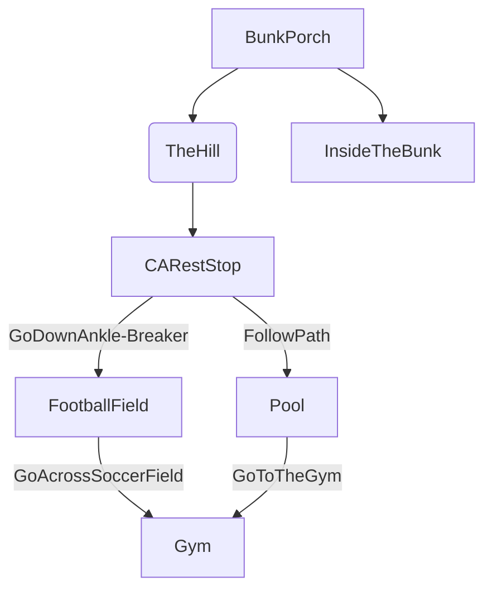

# 1st Day at Camp

## Setting

This game takes place at camp Airy.

## Map

The player starts at the bunks, and then is directed down the hill.
They can explore, but must eventually make their way to the gym.

## Story
At the begining you start when the bell rings to go to first period, you then have to make your way from your bunk down to the gym.

## Global Variables

The most important variables are
`HasWater` and `HasShoes`, both
booleans that track progress in the
story. Depending on these two variables,
some rooms will display different things.